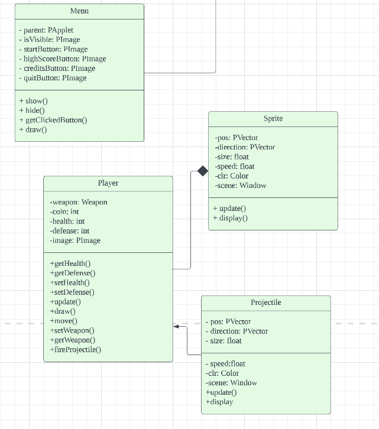

Jack:Menu, Player,ProjectileType and test. The Menu class is responsible for rendering the game's main menu, allowing the user to navigate between different game modes and options. The Player class extends the Sprite class and represents the player's character in the game. The ProjectileType1 class extends the Projectile class and defines the projectiles fired by the player's character.

